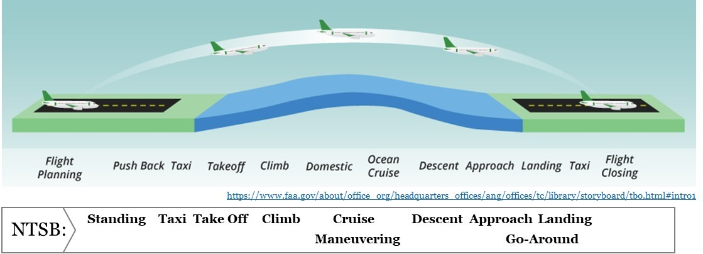
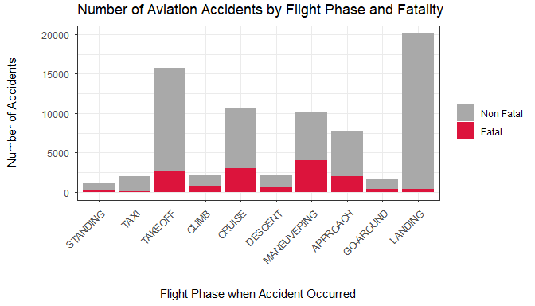
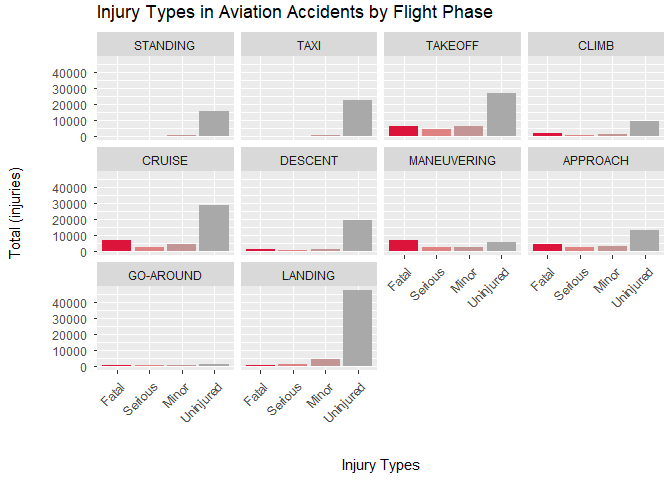
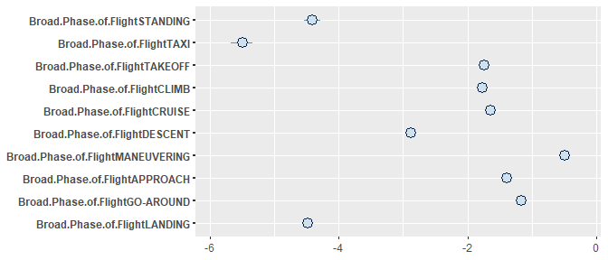
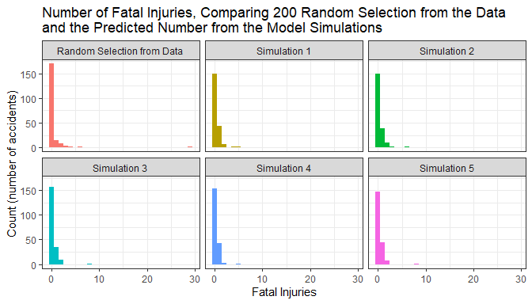

Flight Phases and Fatality in Aviation
================
Vanessa Tandiman
2/14/2021

## Introduction

The aviation industry offers many services and conveniences, and over
the years, it has made a lot of progress to improve the safety of
flying. People fly for various reasons, such as leisure/travel,
business, cargo and shipping, aerial observation and research, personal
hobbies, etc. Just as other transportation modes, things can go wrong
during a flight, and unfortunately, we have seen many catastrophic
accidents resulting in the loss of many lives. An aviation accident is
usually followed up by a thorough investigation to determine the factors
causing the accident and to ensure that lessons are learned to prevent
similar occurrences.

This project will use aviation accidents’ historical data to focus on
the flight phase during which the accidents occurred and the fatalities
caused. We will try to address the question: which flight phase is more
dangerous? The answer to this question could motivate a more focused
study to improve aviation safety, either through some technology
advancement, regulation implementation, or modifications in operational
practices.

To answer this question using the information available in the dataset,
we would first compare the number of accidents across the different
flight phases. In each accident, the people on board could either be
uninjured, injured (minor to serious injuries) or fatally injured. If an
accident has at least one person that is fatally injured, the accident
is considered fatal. We will then compare the fatality rate for each
accident across the different flight phases. We will use the logistic
binomial model to model the fatality proportion in each accident as a
function of the flight phase.

## Data Overview

The aviation accidents data set we use is accessible from Kaggle
website[^1], and is originated from the National Transportation Safety
Board (NTSB) database. It contains information about aviation accidents,
the oldest one being from November 1948. There is only one recorded
accident for that year. The latest recorded aviation accident in the
data set is dated May 9th, 2020. There is more than 84,000 aviation
accidents and incidents in the data set from various countries.
According to the NTSB website, an accident is defined as “an occurrence
associated with the operation of an aircraft which takes place between
the time any person boards the aircraft with the intention of flight and
all such persons have disembarked, and in which any person suffers death
or serious injury, or in which the aircraft receives substantial
damage”. On the other hand, an incident is defined as “an occurrence
other than an accident, associated with the operation of an aircraft,
which affects or could affect the safety of operations.” [^2]. For this
project, we will only look at the recorded accidents.

To address our research question, we will focus on the columns for the
number of injuries and fatalities and the column indicating the flight
phase during which the accident occurred. Below is a preview of the
information we use from the data set.

| Date       | Location                                            | Total Fatal Injuries | Total Serious Injuries | Total Minor Injuries | Total Uninjured | Flight Phase |
|:-----------|:----------------------------------------------------|:--------------------:|:----------------------:|:--------------------:|:---------------:|:-------------|
| 2020-04-25 | East Hampton, NY                                    |          0           |           0            |          0           |        3        | APPROACH     |
| 2020-03-20 | Canyon, TX                                          |          0           |           0            |          0           |        1        | LANDING      |
| 2020-01-08 | Tehran, Iran                                        |         176          |           0            |          0           |        0        | TAKEOFF      |
| 2019-05-05 | Moscow, Russia                                      |          41          |           0            |          0           |       39        | TAKEOFF      |
| 2015-07-22 | Tifalmin Village Papua New Guinea, Papua New Guinea |          0           |           0            |          1           |        0        | MANEUVERING  |
| 2012-01-30 | Cascade, ID                                         |          0           |           0            |          0           |        1        | LANDING      |

Preview of the NTSB Aviation Accident Data Set

There are some missing data in the data set. We exclude any accidents
that have incomplete information about the number of people on board and
any accidents that do not have information about the flight phase or any
with “UNKNOWN” flight phase. The flight phase in this data refers to
“the point in the aircraft operation profile in which the event
occurred.” [^3] There are 10 flight phases in the data set: Standing,
Taxi, Take Off, Climb, Cruise, Descent, Maneuvering, Approach,
Go-Around, and Landing. Explanation of each phase could be found
here[^4]. The FAA (Federal Aviation Administration) website has an
illustration of the different flight phases. The NTSB uses slightly
different wordings for the phases, and these are added to the picture to
help illustrate the flight phases in the data set.



If an accident involves two aircraft, the original data set would have
two rows, one for each aircraft. But the number of injuries and
fatalities are duplicated in both rows, so we remove the duplicated
record before proceeding to work with the data. This leaves us with
73,514 rows of aviation accidents. Below is the summary of the variables
of interest from the data set.

     Total.Fatal.Injuries Total.Serious.Injuries Total.Minor.Injuries
     Min.   :  0.0000     Min.   : 0.0000        Min.   :  0.0000    
     1st Qu.:  0.0000     1st Qu.: 0.0000        1st Qu.:  0.0000    
     Median :  0.0000     Median : 0.0000        Median :  0.0000    
     Mean   :  0.4008     Mean   : 0.2066        Mean   :  0.3312    
     3rd Qu.:  0.0000     3rd Qu.: 0.0000        3rd Qu.:  0.0000    
     Max.   :265.0000     Max.   :81.0000        Max.   :171.0000    
                                                                     
     Total.Uninjured   Total.Souls.Onboard Broad.Phase.of.Flight
     Min.   :  0.000   Min.   :  1.000     LANDING    :20096    
     1st Qu.:  0.000   1st Qu.:  1.000     TAKEOFF    :15737    
     Median :  1.000   Median :  2.000     CRUISE     :10620    
     Mean   :  2.576   Mean   :  3.515     MANEUVERING:10235    
     3rd Qu.:  2.000   3rd Qu.:  2.000     APPROACH   : 7731    
     Max.   :699.000   Max.   :699.000     DESCENT    : 2169    
                                           (Other)    : 6926    

The observation unit for “Broad.Phase.of.Flight” is the aviation
accident or the number of flights that end up in accidents, whereas the
other variables records the number of injuries or individual unit. We
see that the number of injured persons is mostly 0, with the nonzero
numbers appearing mostly between the third and maximum. This is because
most of the flights in the data carry only a few people on board, as
seen in the summary for the variable “Total.Souls.Onboard”. About 80% of
the flights have less than three souls on board. These are usually
flights for personal, business, instructional, aerial application, and
aerial observation purposes. There are many other aviation accidents
that we can not include in this study because there is no known
information for the flight phase during which the accident occurs.

## Data Visualization

As mentioned earlier, to learn about which flight phase is more
dangerous, we first observe and compare the number of accidents during
different flight phases. Figure shows the number of accidents during the
different flight phases, where the color indicates fatality. Fatal
accidents are all accidents that involve at least one fatality.

<figure>

<figcaption aria-hidden="true">The number of aviation accidents for
different flight phases. More accidents happen during landing and take
off, but most of those accidents are not fatal. The highest numbers of
fatal accidents happen during maneuvering, cruise, take-off, and
approach.</figcaption>
</figure>

We can see that landing and take-off have the highest number of
accidents. However, most of these accidents are not fatal. The highest
numbers of fatal accidents occur during maneuvering, cruise, take-off
and approach. The NTSB website describes the maneuvering phase as
“low-altitude/aerobatic flight operations”. Furthermore it explains that
these are usually performed in air shows, training flights, observation
work, demonstration, photography work, aerial application, or other
similar activity[^5].

Another way to see which flight phase is more dangerous is by comparing
the number of injuries caused by the accidents that happened during the
different flight phases. The data set classifies the injuries into four
categories: fatal injuries, serious injuries, minor injuries, and
uninjured. Figure shows that maneuvering, cruise, take off, and approach
have the highest number of fatalities. We noted earlier that these four
phases have the top four number of fatal accidents.

<figure>

<figcaption aria-hidden="true">The number of injuries sustained in
aviation accidents across different flight phases. Maneuvering, cruise,
and take-off have the highest number of fatal injuries in the data. Even
though maneuvering has shown to have far more fatal accidents, the
number of fatal injuries is not far superior. Most of the flights that
got into accidents during the maneuvering phase are flights for
personal, aerial application, and instructional purposes. Therefore,
they do not have a lot of souls on board.</figcaption>
</figure>

One good thing to point out is that, except for maneuvering, the number
of uninjured is greater than the number of fatalities. We see that in
most of the flight phases, there is a fair amount of people uninjured.
When we compare the number of accidents earlier in Figure , we see that
the number of fatal accidents in maneuvering is far higher than the
other flight phases. However, when we compare the number of fatalities,
maneuvering does not differ by much from cruise and take off. Most of
the accidents that happen during maneuvering are flights for personal,
aerial application, and instructional purposes, and these flights
usually do not have many people on board.

## Statistical Procedure

Using the number of fatal injuries and the number of nonfatal injuries
(including those uninjured) in each accident, we will construct a model
for fatality proportion based on flight phases. We use the logistic
binomial model, with the number of fatal injuries representing the
number of ‘success’ in the binomial model.

$$y_i \sim Binomial(n_i, p_i) $$ $$p_i = logit^{-1}(X_i\beta),$$

where $X$ is a matrix of predictors consisting of the flight phases, the
number of fatal injuries, and the number of non-fatal injuries. $p_i$ is
the probability of a person being fatally injured from a flight accident
that occurs during the flight phase $x_i$. $n_i$ is the number of souls
on board or the total of fatal and non-fatal injuries. $\beta$ is the
coefficient of the linear model associated with the different flight
phases.

    ## stan_glm
    ##  family:       binomial [logit]
    ##  formula:      cbind(Total.Fatal.Injuries, Total.Non.Fatal) ~ Broad.Phase.of.Flight - 
    ##     1
    ##  observations: 73514
    ##  predictors:   10
    ## ------
    ##                                  Median MAD_SD
    ## Broad.Phase.of.FlightSTANDING    -4.41   0.07 
    ## Broad.Phase.of.FlightTAXI        -5.50   0.10 
    ## Broad.Phase.of.FlightTAKEOFF     -1.74   0.01 
    ## Broad.Phase.of.FlightCLIMB       -1.78   0.03 
    ## Broad.Phase.of.FlightCRUISE      -1.64   0.01 
    ## Broad.Phase.of.FlightDESCENT     -2.88   0.03 
    ## Broad.Phase.of.FlightMANEUVERING -0.50   0.02 
    ## Broad.Phase.of.FlightAPPROACH    -1.38   0.02 
    ## Broad.Phase.of.FlightGO-AROUND   -1.16   0.04 
    ## Broad.Phase.of.FlightLANDING     -4.48   0.04 
    ## 
    ## ------
    ## * For help interpreting the printed output see ?print.stanreg
    ## * For info on the priors used see ?prior_summary.stanreg

The standard errors of the estimated coefficients are relatively small,
which means there is not much uncertainty in the logit scale. The
estimated coefficients are in the logit scale, but since logit inverse
is an increasing function, the flight phase with the largest coefficient
would be the flight phase associated with the largest estimated
probability of being fatally injured in an accident. We can see from the
graph below that maneuvering is associated with the largest probability
of being fatally injured should an accident happen during that phase.
This is consistent with what we have seen before in the data
visualization.

<figure>

<figcaption aria-hidden="true">Plot of the linear coefficients from the
logistic binomial regression model. The coefficients correspond with the
probability of being fatally injured from an accident during a
particular flight phase.</figcaption>
</figure>

The table below presents the probability interpretation of the
coefficients for each flight phase.

| Flight Phase | Linear Coefficients | Probability of Being Fatally Injured | Lower Bound 95% CI | Upper Bound 95% CI |
|:-------------|:-------------------:|:------------------------------------:|:------------------:|:------------------:|
| Standing     |     -4.4092603      |                 0.01                 |        0.01        |        0.01        |
| Taxi         |     -5.4986522      |                 0.00                 |        0.00        |        0.00        |
| Take Off     |     -1.7368456      |                 0.15                 |        0.15        |        0.15        |
| Climb        |     -1.7752131      |                 0.14                 |        0.14        |        0.15        |
| Cruise       |     -1.6394277      |                 0.16                 |        0.16        |        0.17        |
| Descent      |     -2.8764765      |                 0.05                 |        0.05        |        0.06        |
| Maneuvering  |     -0.4963727      |                 0.38                 |        0.37        |        0.39        |
| Approach     |     -1.3832696      |                 0.20                 |        0.20        |        0.21        |
| Go-Around    |     -1.1597394      |                 0.24                 |        0.22        |        0.25        |
| Landing      |     -4.4778970      |                 0.01                 |        0.01        |        0.01        |

Result from the Logistic Binomial model

According to the model, the phase associated with the second-highest
probability of being fatally injured is go-around, which is interesting
because it did not stand out before in the data visualizations. From
Figure , we see that the injury numbers for go-around is much lower
compared to the other flight phases. However, for accidents that happen
during the go-around phase, the number of fatally injured people is
almost the same as the number of uninjured people. This could explain
why the statistical model assigns a relatively high probability of being
fatally injured in an accident that occurs during the go-around phase.
Furthermore, when an airplane has to do a go-around, it usually means
that the initial landing attempt is unsuccessful. This could imply the
presence of other risk factors such as bad weather, technical issues,
etc.

We note that the independence of error assumption is violated in the
model. When they are all in the same aircraft, the probability of being
fatally injured from one person to another is not independent. We also
acknowledge that an aviation accident usually happens due to various
factors, which is not accommodated in the simple statistical model we
are using. However, since the goal of the study is not necessarily to
find a predictive model but rather to learn from the historical data if
there is a flight phase that is associated with more danger or fatality,
we think the model could still be a reasonable reference.

We perform a simple posterior check by using a random subset of the
data. A random selection of 200 accidents is selected from the data, and
we compare the number of fatalities with the first five simulations from
the model, as shown in Figure . We see that the simulations mostly
underestimate the number of accidents with - injuries. But the
simulations do not capture the variation in the data. The data shows at
least one accident with more than 200 fatal injuries, but none of the
simulations nearly capture that. This is a case of overdispersion, which
is common in a logistic binomial regression model.

<figure>

<figcaption aria-hidden="true">The model simulations mostly
underestimate the number of 0 fatalities compared with the random subset
of the data. The simulations also do not capture the variation in the
data very well. This is a case of overdispersion.</figcaption>
</figure>

This statistical model could potentially be improved through further
study and analysis on:

- overdispersion, since the variation in the data is larger than
  predicted by the model;

- a mixed model or latent model, using two models for the probability of
  an accident being fatal and the probability of being fatally injured.

## Discussion

Referring back to the research question, from this data, we see that
maneuvering seems to be the flight phase associated with the highest
probability of being fatally injured. Even though more accidents seem to
happen during the landing and take-off phases, most of these accidents
are not fatal. The maneuvering phase has the highest number of fatal
accidents in the data set and is associated with the highest probability
of a person onboard being fatally injured. The statistical model using
logistic binomial regression agrees that an accident that happens during
maneuvering phase has a higher probability of being fatally injured than
accidents that happen during other phases. This concurs with a claim by
FAA, where it also explains that the maneuvering phase involves
“turning, climbing, or descending close to the ground”[^6].

Other phases that are considerably more dangerous are cruise, take off,
and approach. The go-around phase also appears among the more dangerous
phases, according to the statistical model.

Since this is an observational study, we can only learn of the
association between the flight phases when an accident occurs and the
probability of being fatally injured. The greater danger is not
necessarily caused by the maneuvering flight phase. Many factors cause
an aviation accident. It is possible that the maneuvering phase,
compared to other flight phases, involves more difficult tasks to
perform, and is highly dependent on the nearby terrain and weather, such
that it exposes the aircraft to various factors that could cause an
accident. Moreover, we acknowledge that many aviation accidents do not
have clear information about the flight phase, and because of that,
those can not be included in this study and we might not have a fair
representation.

### References

<div id="refs" class="references csl-bib-body hanging-indent">

<div id="ref-Antonacci2020" class="csl-entry">

Antonacci, Andrea. 2020. “Exploring the NTSB Aviation Accident
Database.” *GitHub Repository*.
<https://andreantonacci.github.io/aviation-accidents/>; GitHub.

</div>

<div id="ref-R-gridExtra" class="csl-entry">

Auguie, Baptiste. 2017. *gridExtra: Miscellaneous Functions for "Grid"
Graphics*. <https://CRAN.R-project.org/package=gridExtra>.

</div>

<div id="ref-R-ggpubr" class="csl-entry">

Kassambara, Alboukadel. 2020. *Ggpubr: ’Ggplot2’ Based Publication Ready
Plots*. <https://CRAN.R-project.org/package=ggpubr>.

</div>

<div id="ref-R-base" class="csl-entry">

R Core Team. 2020. *R: A Language and Environment for Statistical
Computing*. Vienna, Austria: R Foundation for Statistical Computing.
<https://www.R-project.org/>.

</div>

<div id="ref-R-tidyverse" class="csl-entry">

Wickham, Hadley, Mara Averick, Jennifer Bryan, Winston Chang, Lucy
D’Agostino McGowan, Romain Fran?ois, Garrett Grolemund, et al. 2019.
“Welcome to the <span class="nocase">tidyverse</span>.” *Journal of Open
Source Software* 4 (43): 1686. <https://doi.org/10.21105/joss.01686>.

</div>

<div id="ref-R-ggplot2" class="csl-entry">

Wickham, Hadley, Winston Chang, Lionel Henry, Thomas Lin Pedersen,
Kohske Takahashi, Claus Wilke, Kara Woo, Hiroaki Yutani, and Dewey
Dunnington. 2020. *Ggplot2: Create Elegant Data Visualisations Using the
Grammar of Graphics*. <https://CRAN.R-project.org/package=ggplot2>.

</div>

<div id="ref-R-dplyr" class="csl-entry">

Wickham, Hadley, Romain François, Lionel Henry, and Kirill Müller. 2020.
*Dplyr: A Grammar of Data Manipulation*.
<https://CRAN.R-project.org/package=dplyr>.

</div>

<div id="ref-R-knitr" class="csl-entry">

Xie, Yihui. 2020. *Knitr: A General-Purpose Package for Dynamic Report
Generation in r*. <https://CRAN.R-project.org/package=knitr>.

</div>

</div>

``` r
# https://www.rapidtables.com/web/color/red-color.html
# https://bookdown.org/yihui/rmarkdown-cookbook/kable.html
```

  

### Appendix

The code used in this paper is found below.

``` r
knitr::opts_chunk$set(echo = TRUE)
library(tidyverse)
library(rstanarm)
library(knitr)
library(kableExtra)
library(ggplot2)
data_raw <- read.csv("AviationData.csv") %>%
      filter(Investigation.Type == "Accident") %>%
      filter(Broad.Phase.of.Flight != "") %>%
      filter(Broad.Phase.of.Flight != "UNKNOWN")%>%
   filter(Broad.Phase.of.Flight != "OTHER")
data_survive <- data_raw[!duplicated(data_raw$Event.Id),] #19200 row 19200 unique

data_survive$Total.Fatal.Injuries[is.na(data_survive$Total.Fatal.Injuries)] <- 0
data_survive$Total.Minor.Injuries[is.na(data_survive$Total.Minor.Injuries)] <- 0
data_survive$Total.Serious.Injuries[is.na(data_survive$Total.Serious.Injuries)] <- 0
data_survive$Total.Uninjured[is.na(data_survive$Total.Uninjured)] <- 0
data_survive <- data_survive %>% 
      mutate(Total.Non.Fatal= Total.Serious.Injuries+Total.Minor.Injuries+Total.Uninjured) %>%
      mutate(Total.Souls.Onboard = Total.Non.Fatal+Total.Fatal.Injuries) %>%
      mutate(Is.Fatal = factor(as.integer(Total.Fatal.Injuries != 0))) %>%
      filter(Total.Souls.Onboard > 0) %>%
   mutate(Fatality.Prop = Total.Fatal.Injuries/Total.Souls.Onboard)
data_survive$Broad.Phase.of.Flight <- factor(data_survive$Broad.Phase.of.Flight, 
                                             levels= c("STANDING", "TAXI", "TAKEOFF",
                                                       "CLIMB","CRUISE",
                                                       "DESCENT","MANEUVERING",
                                                       "APPROACH","GO-AROUND",
                                                       "LANDING"))

preview <- data_survive[c(12,64,223,1176,5912,10141),c(4,5,24,25,26,27,29)]
knitr::kable(preview, "pipe", booktabs=T,
             col.names = c("Date", "Location", "Total Fatal Injuries", 
                           "Total Serious Injuries", "Total Minor Injuries",
                           "Total Uninjured", "Flight Phase"),
             row.names = F, align = "llccccl",
             caption = "Preview of the NTSB Aviation Accident Data Set")
tunjuk <- data_survive[,c(24,25,26,27,33,29)]
tunjuk$Broad.Phase.of.Flight <- factor(tunjuk$Broad.Phase.of.Flight)
summary(tunjuk, digits = 0)


data_survive %>% ggplot(aes(x=Broad.Phase.of.Flight, fill=Is.Fatal)) +
      geom_bar(position = position_stack()) +
      labs(title = "Number of Aviation Accidents by Flight Phase and Fatality", 
           x = "Flight Phase when Accident Occurred", y = "Number of Accidents", 
           fill = " ") +
   scale_fill_manual(values=c("#A9A9A9","#DC143C"), 
                     labels = c("Non Fatal","Fatal")) +
   theme_bw() + 
   theme(axis.text.x = element_text(margin = margin(t = 5, b = 20), 
                                    angle = 45, hjust = 1),
            axis.text.y = element_text(margin = margin(r = 5, l = 20)),
            plot.title = element_text(vjust=2))


library(dplyr)
sums <- data_survive %>% group_by(Broad.Phase.of.Flight) %>%
   summarise(Fatal.Injuries = sum(Total.Fatal.Injuries),
             Serious.Injuries = sum(Total.Serious.Injuries),
             Minor.Injuries = sum(Total.Minor.Injuries),
             Uninjured = sum(Total.Uninjured))
sums <- as.data.frame(sums)
sums_bar <- tibble(Sums = stack(sums[2:5])[,1] ,
                   Injury.Type = rep(c('Fatal', 'Serious', 'Minor',
                                       'Uninjured'), each=10),
                   Phase = rep(c('STANDING', 'TAXI', 'TAKEOFF','CLIMB',
                                 'CRUISE','DESCENT','MANEUVERING','APPROACH',
                                 'GO-AROUND','LANDING'),4))
sums_bar$Phase <- factor(sums_bar$Phase,
                         levels = c('STANDING', 'TAXI', 'TAKEOFF','CLIMB',
                                    'CRUISE','DESCENT','MANEUVERING','APPROACH',
                                    'GO-AROUND','LANDING'))
sums_bar$Injury.Type <- factor(sums_bar$Injury.Type, 
                               levels = c('Fatal', 'Serious',
                               'Minor', 'Uninjured'))
   
sums_bar %>% ggplot(aes(x=Injury.Type, fill = Injury.Type)) +
   geom_bar(aes(y=Sums), stat = "sum") + 
   scale_fill_manual(values=c("#DC143C","#DF8282",
                              "#C49595","#A9A9A9")) +
   facet_wrap(.~Phase) + xlab("Injury Type") + ylab("Total (persons)") +
   ggtitle("Injury Types in Aviation Accidents by Flight Phase")  + 
   theme(legend.position = "none") + 
   theme(axis.text.y = element_text(margin = margin(r = 5, l = 20)),
            plot.title = element_text(vjust=2))


set.seed(20210216)
fit_logit <- stan_glm(cbind(Total.Fatal.Injuries,Total.Non.Fatal)~Broad.Phase.of.Flight-1, 
                        family = binomial(link = "logit"), 
                        data = data_survive, refresh=0)
print(fit_logit, digits = 2)


plot(fit_logit)

fit_logit_tbl <- tibble(Broad.Phase.of.Flight = (c("Standing",
                                                   "Taxi",
                     "Take Off","Climb","Cruise","Descent",
                    "Maneuvering","Approach","Go-Around","Landing")),
                     Coef = fit_logit$coefficients, 
                     Prob = round(invlogit(fit_logit$coefficients),2),
                     ConfInt.low = invlogit(fit_logit$coefficients-2*fit_logit$ses),
                     ConfInt.up = invlogit(fit_logit$coefficients+2*fit_logit$ses)) 
knitr::kable(fit_logit_tbl, "pipe", 
             col.names = c("Flight Phase","Linear Coefficients", 
                           "Probability of Being Fatally Injured", 
                           "Lower Bound 95% CI", "Upper Bound 95% CI"),
             row.names = F,
             align = "lcccc",
             caption = "Result from the Logistic Binomial model")


set.seed(20210216)
selection <- sample(1:nrow(data_survive),200)
data_check<- select(data_survive,c(Broad.Phase.of.Flight, 
                                   Total.Fatal.Injuries,Total.Non.Fatal))[selection,]
posterior_check <- posterior_predict(fit_logit, data_check)
for_resid <- tibble(Fatal = c(data_check$Total.Fatal.Injuries,
                                  posterior_check[1,],
                                  posterior_check[2,],
                                  posterior_check[3,],
                              posterior_check[4,],
                              posterior_check[5,]),
                    From = rep(c("Random Selection from Data",
                                 "Simulation 1",
                                 "Simulation 2","Simulation 3",
                                 "Simulation 4", "Simulation 5"),
                               each=200))
for_resid %>% ggplot(aes(x=Fatal, fill=From)) +
   geom_histogram(binwidth = 1) + facet_wrap(.~From) + theme_bw() +
   theme(legend.position = 'none') + xlab("Fatal Injuries (persons)") +
   ylab("Count (number of accidents)")+
   ggtitle("Number of Fatal Injuries, Comparing 100 Random Selection 
           from the Data \n and the Predicted Number from the Model Simulations ")
```

[^1]: <https://www.kaggle.com/khsamaha/aviation-accident-database-synopses>

[^2]: <https://www.ntsb.gov/_layouts/ntsb.aviation/AviationQueryHelp.aspx>

[^3]: <https://www.ntsb.gov/_layouts/ntsb.aviation/AviationDownloadDataDictionary.aspx>

[^4]: <https://www.ntsb.gov/investigations/data/Documents/datafiles/PhaseofFlightDefinitions.pdf>

[^5]: <https://www.ntsb.gov/investigations/data/Documents/datafiles/PhaseofFlightDefinitions.pdf>

[^6]: <https://www.faa.gov/news/safety_briefing/2018/media/SE_Topic_18_08.pdf>
